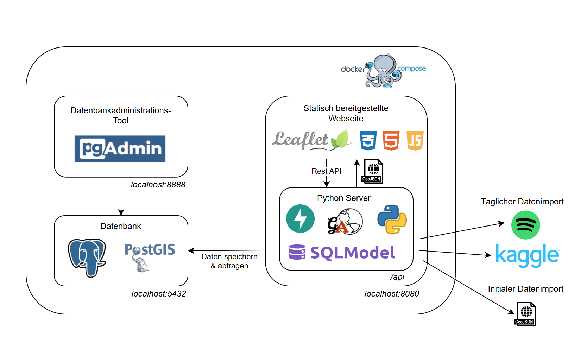

# Spotify Trend Analysis App
Spotify is one of the most popular music streaming services.
This project aims to analyse the listening habits of users
all across the world by visualising trends on an interactive map. 
Features include identifying the most popular track, artist or album
per country and comparing the popularity of a specific track, artist
or album between the different countries. 

The dataset used is: 
https://www.kaggle.com/datasets/asaniczka/top-spotify-songs-in-73-countries-daily-updated. 
A delta-import is performed daily to ensure the information of the application is always up to date.
The Spotify-API is furthermore used to retrieve additional metadata for the tracks
in the dataset.

## Technology Stack
- Python backend (Relevant libraries: FastAPI, Pydantic & SQLModel)
- PostGIS database
- Leaflet Frontend



## Setup Instructions

In the following the setup of the application is described. 
If any issues occur, please do not hesitate to contact me. 

### Requirements
- Docker Compose (tested with version v.2.32.4, you may check the installed version with `docker compose version`)
- Running Docker Engine

### Database initialisation
On first start-up of the application all data has to be downloaded from 
Kaggle and the according metadata has to be retrieved using the Spotify-API. 
To speed up this process, a PostgreSQL volume including all data up to 03/04/2025
is included as part of this repository. To use it, please unzip the file `data.zip` into 
the project folder.

The resulting folder structure should look like this:
```
app
|- ...
data
|- base
|- global
|- pg_commit_ts
|- ...
documentation
|- ...
static
|- ...
docker-compose.yml
Dockerfile
...
```

### Starting the stack
Start the software stack:
````bash
docker compose up -d
````

Check container logs:
````bash
docker compose logs -f <container-name>
````

Stop the software stack: 
````bash
docker compose down
````


### Available services
| Service     | URL                                                              | Credentials                   |
|-------------|------------------------------------------------------------------|-------------------------------|
| Application | [http://localhost:8080](http://localhost:8080)                   | Non required                  |
| API         | [http://localhost:8080/api/docs](http://localhost:8080/api/docs) | Non required                  |
| PostGIS     | [http://localhost:5432](http://localhost:5432)                   | postgres:postgres             |
| pgAdmin     | [http://localhost:8888](http://localhost:8888)                   | postgres@postgres.de:postgres |

### Connecting to the database with pgAdmin
Login to pgAdmin, add a server and use the following settings:
- **Hostname**: db
- **Port**: 5432
- **Credentials**: See above (postgres:postgres)

### Troubleshooting
There are some known issues with starting the application that occurred during development.
In the following the solutions for these issues are listed. 

#### Database not available

When the database is not yet available, the app will fail to start. 
To mitigate this issue, simply stop the app and restart it (`docker compose down app && docker compose up -d app`).
The error that indicates this issue is: 

````
sqlalchemy.exc.OperationalError: (psycopg2.OperationalError) could not translate host name "db" to address: Name or service not known
````

#### Fresh database not initialising

When using a completely fresh database (empty or no `data` folder), the database may 
fail to start initially. Just restart it until it works.
